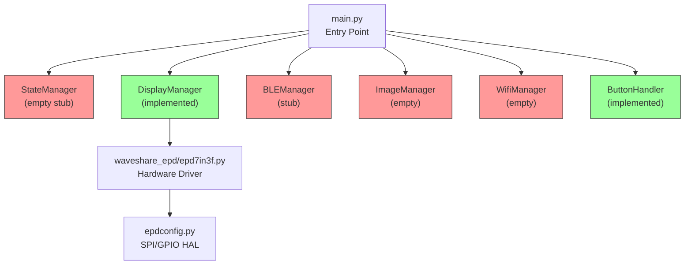
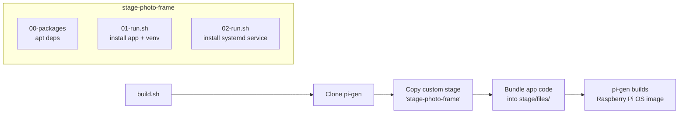

# Photo Frame Controller — Codebase Deep Dive

## What Is This?

A **Raspberry Pi controller for a 7.3-inch Waveshare E-Ink display** (model `7in3f`). The goal is a "set it and forget it" digital photo frame that:

1. Boots up and shows a default image on first run
2. Advertises over **BLE** so a companion app can configure it
3. Operates in either **offline** (locally stored images, carousel) or **online** (fetches from a server URL over WiFi) mode
4. **Sleeps between refreshes** to save power
5. Has a physical **reset button** (GPIO 17) to re-enter setup mode
6. Ships as a **flashable OS image** built with `pi-gen` + GitHub Actions CI

---

## Architecture



> [!NOTE]
> Green = implemented, Red = empty stub. The main loop currently only calls `DisplayManager.show_default()`.

---

## Module-by-Module Breakdown

### [main.py](file:///home/saxanmol/workspace/photo-frame/photo-frame-controller/app/main.py)
The entry point. Most of the intended flow is **commented out** — only `DisplayManager().show_default()` executes. The commented code reveals the planned lifecycle:

```
first_boot? → show default image → BLE setup mode → return
offline mode? → show next image from local carousel
online mode? → connect WiFi → fetch & display from server
finally → schedule sleep (RTC/systemd timer)
```

### [display_manager.py](file:///home/saxanmol/workspace/photo-frame/photo-frame-controller/app/display_manager.py)
**Most complete module.** Wraps the Waveshare EPD driver:
- Lazy-initializes the display hardware on first use
- `show_image(path)` — opens a PIL image, resizes to 800×480, converts to RGB, sends to display, then puts the EPD to sleep
- `show_default()` — hardcoded path `/opt/photo-frame-controller/config/default.jpg`
- `clear()` / `shutdown()` — helper methods

### [button_handler.py](file:///home/saxanmol/workspace/photo-frame/photo-frame-controller/app/button_handler.py)
Listens for a falling-edge interrupt on **GPIO 17** (BCM mode, with internal pull-up). On press → calls `state.reset()`. Functional but depends on the unimplemented `StateManager.reset()`.

### [ble_manager.py](file:///home/saxanmol/workspace/photo-frame/photo-frame-controller/app/ble_manager.py) — Stub
Just prints "BLE setup mode started". Will use the `bluezero` library (in `requirements.txt`).

### [state_manager.py](file:///home/saxanmol/workspace/photo-frame/photo-frame-controller/app/state_manager.py) — Empty
Intended to manage persistent state from `data/state.json`. Expected methods: `is_first_boot()`, `reset()`, `mode` property, `schedule_sleep()`.

### [image_manager.py](file:///home/saxanmol/workspace/photo-frame/photo-frame-controller/app/image_manager.py) — Empty
Intended to handle both offline carousel (`show_next_image()`) and online fetch (`fetch_and_show()`).

### [wifi_manager.py](file:///home/saxanmol/workspace/photo-frame/photo-frame-controller/app/wifi_manager.py) — Empty
Intended: `ensure_connected()` — presumably configures `wpa_supplicant` or `nmcli`.

---

## State Model

Two identical JSON files define the state schema:

| File | Purpose |
|------|---------|
| [config/default-state.json](file:///home/saxanmol/workspace/photo-frame/photo-frame-controller/config/default-state.json) | Factory-default template |
| [data/state.json](file:///home/saxanmol/workspace/photo-frame/photo-frame-controller/data/state.json) | Runtime state (mutable) |

```json
{
  "first_boot": true,
  "mode": null,           // "offline" or "online"
  "wifi_configured": false,
  "server_url": null,     // online mode endpoint
  "offline_images": []    // local image paths for offline carousel
}
```

A `reset()` would copy `default-state.json` → `data/state.json`.

---

## Hardware Details

| Component | Detail |
|-----------|--------|
| **Display** | Waveshare 7.3" E-Paper HAT (F) — 7-color (black, white, green, blue, red, yellow, orange) |
| **Resolution** | 800 × 480 pixels |
| **Interface** | SPI (via `epdconfig.py`) |
| **Color encoding** | 4-bit per pixel (2 pixels packed per byte → 192,000 bytes per frame) |
| **Refresh** | Full refresh with power-on → display → power-off cycle |
| **Reset button** | GPIO 17 (BCM), falling-edge interrupt with PUD_UP |

The driver quantizes any RGB image down to the 7-color palette with dithering via PIL's `quantize()`.

---

## Deployment Pipeline

### OS Image Build (pi-gen)



- **[00-packages](file:///home/saxanmol/workspace/photo-frame/photo-frame-controller/image-builder/stage-photo-frame/00-packages)** — installs: `python3-venv python3-pip git bluez bluetooth libjpeg-dev libopenjp2-7 libtiff5`
- **[01-run.sh](file:///home/saxanmol/workspace/photo-frame/photo-frame-controller/image-builder/stage-photo-frame/01-run.sh)** — copies app to `/opt/photo-frame-controller`, creates venv, installs pip deps, enables bluetooth
- **[02-run.sh](file:///home/saxanmol/workspace/photo-frame/photo-frame-controller/image-builder/stage-photo-frame/02-run.sh)** — installs and enables the systemd service

The [pi-gen config](file:///home/saxanmol/workspace/photo-frame/photo-frame-controller/image-builder/config) uses a minimal stage list: `stage0 stage1 photo-frame` (no desktop environment — headless only).

### Systemd Service

[photo-frame-controller.service](file:///home/saxanmol/workspace/photo-frame/photo-frame-controller/service/photo-frame-controller.service):
- Runs as user `saxanmol`
- `WorkingDirectory=/opt/photo-frame-controller`
- `ExecStart=.../venv/bin/python app/main.py`
- `Restart=always`
- Depends on `network.target bluetooth.target`

### CI/CD

[build-image.yml](file:///home/saxanmol/workspace/photo-frame/photo-frame-controller/.github/workflows/build-image.yml):
- Triggers on `workflow_dispatch` and version tags (`v*.*.*`)
- Runs on `ubuntu-22.04` with 3-hour timeout
- Installs all pi-gen host dependencies → runs `build.sh` with sudo
- Uploads the generated OS image as a GitHub Actions artifact

---

## Git History & Branch Status

```
719e980 (HEAD -> build-workflow-setup) fixed build path issue
3709955 Added DisplayManager and fixed build path issue
9d1ebd8 Fixing build failures related to environment again
b2086f7 Fixing build failures related to environment again
101a480 Fixing build failures related to environment again
9692612 Fixing build failures related to environment
d715719 (origin/main, main) Python RPi service initial setup
240bb31 Delete old files
0940a9a Initial commit
```

Currently on `build-workflow-setup` branch — **6 commits ahead of `main`**. The recent work has been getting the pi-gen OS image build working.

---

## Implementation Maturity Summary

| Feature | Status | Notes |
|---------|--------|-------|
| Display default image on boot | ✅ Working | Hardcoded path |
| Waveshare EPD driver | ✅ Bundled | Full 7-color `epd7in3f` driver |
| Systemd service | ✅ Working | Auto-restart enabled |
| OS image builder (pi-gen) | ✅ Working | CI pipeline in place |
| Physical reset button | 🟡 Partial | GPIO listener works, but `state.reset()` is unimplemented |
| State management | ❌ Not started | JSON schema defined but no code |
| BLE setup beacon | ❌ Stub only | `bluezero` is a dependency but unused |
| WiFi configuration | ❌ Not started | Empty module |
| Image carousel (offline) | ❌ Not started | Empty module |
| Server image fetch (online) | ❌ Not started | Empty module |
| Sleep/wake scheduling | ❌ Not started | Commented out in main |

> [!IMPORTANT]
> The project currently boots, displays a single hardcoded default image, and exits. All the interesting multi-mode logic is planned but not yet built.
