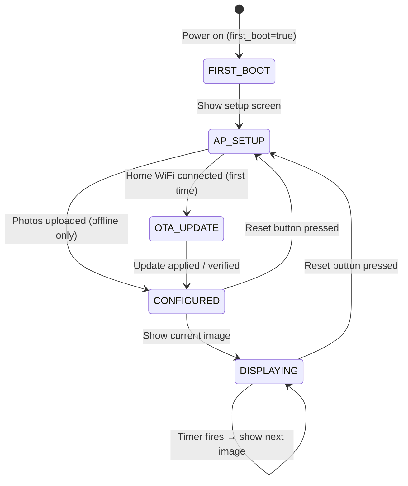

# Photo Frame — Product Requirements Specification

## 1. Project Overview

An e-ink digital photo frame powered by a Raspberry Pi Zero 2W and a Waveshare 7.3" 7-color e-Paper display (800×480). The system provides a zero-setup-required out-of-box experience where the frame boots, shows a setup screen, and lets users configure it entirely through a web browser — no app download required.

### 1.1 System Components

| Component | Technology | Role |
|-----------|-----------|------|
| **Controller** | Python on RPi Zero 2W | Hardware driver, state machine, image processing, OTA updater |
| **API Server** | FastAPI on RPi Zero 2W | REST API for all operations (photo upload, settings, Immich sync) |
| **Web App (PWA)** | HTML/CSS/JS served from RPi | User interface for setup, photo management, editing, and frame configuration |
| **E-Ink Display** | Waveshare 7.3" HAT (F) | 7-color (Black, White, Green, Blue, Red, Yellow, Orange), 800×480 |

### 1.2 Design Principles

1. **Zero-setup out of box** — Flash the SD card, plug in, follow the screen
2. **No internet required for basic use** — Local WiFi AP + direct upload works offline
3. **No app download required** — PWA served from the frame itself
4. **Lightweight** — Everything runs on a RPi Zero 2W (512MB RAM, quad-core ARM Cortex-A53)
5. **Set it and forget it** — Once configured, the frame operates autonomously
6. **Extensible Architecture** — Built to support future additions like widgets (clock, weather) without major overhauls.

---

## 2. Hardware Constraints

> [!IMPORTANT]
> These constraints directly influence architecture and UX decisions.

| Parameter | Value | Impact |
|-----------|-------|--------|
| Resolution | 800 × 480 px | All images must be resized to this |
| Color palette | 7 colors (4-bit encoding, 2px/byte) | Images need dithering/quantization to this palette |
| Refresh time | **~35 seconds** | Users must be told to wait; no rapid updates |
| Min refresh interval | **≥180 seconds** | Hardware requirement — cannot refresh more often |
| Refresh mandatory | **At least once every 24 hours** | Must refresh even if no new image |
| Standby current | <0.01μA | Display holds image with zero power after sleep |
| Operating temp | 15–35°C | Indoor use only |
| Color rendering | 15–35°C for accurate color | Color cast at low temperatures |
| Frame buffer size | 192,000 bytes (800×480÷2) | 4 bits per pixel |
| SPI interface | CPOL=0, CPHL=0 (Mode 0) | Via `epdconfig.py` HAL |
| Reset button | GPIO 17 (BCM), falling edge, pull-up | Physical factory reset |

> [!CAUTION]
> The display **must not remain powered on** when not refreshing. The controller must always call `epd.sleep()` after each refresh to avoid permanent damage.

---

## 3. User Stories

### 3.1 First-Time Setup (Offline — No Internet)
> **As a user**, I unbox the photo frame, plug it in, and within 2 minutes I can see a setup screen that tells me exactly what to do next. I connect my phone to the frame's WiFi hotspot, a web page loads, and I can upload photos directly. No account, no internet, no app download needed.

### 3.2 Home Network Setup
> **As a user**, I want my photo frame on my home WiFi so I can access it from any device on my network without switching WiFi networks.

### 3.3 Photo Upload & Editing (Local)
> **As a user**, I want to select multiple photos from my phone/computer, preview them, crop and rotate them to fit the 800x480 screen perfectly, and see how they will look with the 7-color e-ink palette before confirming the upload.

### 3.4 Over-The-Air (OTA) Updates
> **As a user**, I want my frame to automatically download the latest software updates via GitHub Actions artifacts so I always have the newest features. I want the first update to be mandatory upon connecting to the internet, but I also want the ability to pause or toggle auto-updates in the settings.

### 3.5 Image Carousel
> **As a user**, I want the frame to automatically cycle through my uploaded photos. I want to control whether they play in order or randomly, and how often the image changes (every 1 hour, 4 hours, 12 hours, or 24 hours).

### 3.6 Immich Album Sync
> **As a user**, I have an Immich server with my photo library. I want to point my frame at a specific Immich album and have it automatically sync new photos at a configurable interval.

### 3.7 Widgets (Future Phase)
> **As a user**, I want to optionally display widgets like a digital/analog clock, weather information, or notifications on top of my photos or on a dedicated dashboard screen.

### 3.8 Factory Reset & Storage Management
> **As a user**, I want to press the physical button to reset the frame. I also want to see available storage space and manage my photos through the web interface.

---

## 4. Functional Requirements

### 4.1 Controller (RPi)

#### FR-C01: State Machine
The controller must implement a finite state machine extending to manage OTA updates:



**States:**
| State | Description |
|-------|-------------|
| `FIRST_BOOT` | Initial power-on, no configuration exists |
| `AP_SETUP` | WiFi AP active, captive portal serving PWA, accepting config |
| `OTA_UPDATE` | Frame is connected to internet and applying a mandatory initial update |
| `CONFIGURED` | WiFi connected (or offline with images), ready to display |
| `DISPLAYING` | Actively cycling through images on schedule |

#### FR-C02: WiFi Access Point Mode & Home Network
- On first boot (or after reset), create AP with SSID `PhotoFrame-XXXX`.
- AP must use WPA2 with a default password shown on the e-ink display.
- AP must run DHCP (dnsmasq) and DNS redirection (captive portal to `192.168.4.1`).
- Accept home WiFi credentials and connect via `nmcli` or `wpa_supplicant`.
- Register mDNS hostname via Avahi: `photoframe.local`.

#### FR-C03: OTA Updater
- Check GitHub Actions artifacts (or releases) for new application bundles.
- Perform a mandatory check/update upon first internet connection.
- Download the artifact, extract it, replace `/opt/photo-frame-controller` contents, and restart the systemd service.
- Support a configurable auto-update toggle.

#### FR-C04: Display Management & Widget Extensibility
- Manage Waveshare EPD 7in3f driver.
- Enforce 180s minimum interval and 24h mandatory refresh.
- Always call `epd.sleep()` after each refresh.
- Provide a composite layout engine to support layering (base image + widgets).

#### FR-C05: Image Carousel
- Maintain an ordered list of images stored locally.
- Support sequential and random/shuffle playback order.
- Support configurable refresh intervals: 1hr, 2hr, 4hr, 6hr, 12hr, 24hr.

#### FR-C06: Image Storage & Processing
- Accept images uploaded via HTTP or synced from Immich.
- Pre-process images (crop, resize to 800x480, dither to 7-color palette).
- Track available disk space and reserve system space (~500MB).

#### FR-C07: Immich Integration
- Accept Immich server URL + API key and album ID.
- Poll the Immich API at a configurable interval (1hr, 6hr, 12hr, daily).
- Download new photos, process on-device, and add to local storage.

#### FR-C08: Factory Reset (Button)
- GPIO 17 falling-edge interrupt with debouncing.
- On press: clear all user data and restore default state.

#### FR-C09: First Boot Display
- On first boot, display a setup screen image (programmatically generated using PIL).

---

### 4.2 API Server (FastAPI on RPi)

#### FR-S01: Photo Upload API
- `POST /api/photos/upload` — Accept multipart file uploads. Support `pre_processed=true` flag.

#### FR-S02: Photo Management API
- `GET /api/photos` — List all photos with metadata.
- `DELETE /api/photos/{id}` — Delete a specific photo.
- `GET /api/photos/{id}/thumbnail` — Return thumbnail.

#### FR-S03: Frame Settings API
- `GET /api/settings` and `PUT /api/settings` — Update carousel, hostname, display name, auth.

#### FR-S04: WiFi Configuration API
- `POST /api/wifi/connect`, `GET /api/wifi/status`, `GET /api/wifi/scan`.

#### FR-S05: Immich Configuration API
- Configure Immich (`PUT /api/integrations/immich`), trigger sync, and get status.

#### FR-S06: System Status & OTA API
- `GET /api/system/status` — Return system info (disk space, display state, uptime).
- `POST /api/system/reset` — Trigger factory reset.
- `GET /api/system/ota` — Get current version, update availability, and OTA settings.
- `PUT /api/settings/ota` — Configure auto-update preference.
- `POST /api/system/ota/update` — Manually trigger an update.

#### FR-S07: Display Control API
- `POST /api/display/refresh` — Force next image.
- `POST /api/display/show/{photo_id}` — Display a specific photo immediately.

#### FR-S08: Optional Authentication
- All API endpoints (except `/api/wifi/status`) optionally require a PIN header.

---

### 4.3 Progressive Web App (PWA)

#### FR-W01: Setup Wizard
- Step-by-step guided setup: Welcome → WiFi → Initial OTA Check → Upload → Carousel Config → Done.

#### FR-W02: Photo Upload & Advanced Editing Interface
- Integrated image editor before upload using Cropper.js.
- Enforce 800x480 aspect ratio with crop and rotation.
- **Dithering Preview**: Live preview of the 7-color e-ink palette using a Web Worker.
- **Variations**: Toggle between dithering algorithms (Floyd-Steinberg, Atkinson) or adjust contrast.

#### FR-W03: Photo Gallery & Management
- Grid view of thumbnails, delete, reorder, visual indicator for current photo.

#### FR-W04: Carousel Settings
- Sequential vs Random playback, refresh interval, enable/disable toggle.

#### FR-W05: Immich Integration Settings
- Input fields for URL/API Key, album selector, sync interval.

#### FR-W06: Frame & OTA Settings
- Hostname configuration, WiFi network management.
- OTA settings: toggle auto-updates, view current version.

#### FR-W07: Widget Configuration (Future Phase preparation)
- UI view to toggle widgets (Clock, Weather) and specify positioning.

---

## 5. Non-Functional Requirements

### NFR-01: Performance
- Image processing (dithering) must complete within 60 seconds on RPi Zero 2W (if not done client-side).
- PWA must load within 3 seconds on first visit.
- Client-side dithering in the PWA should use Web Workers to avoid UI blocking.

### NFR-02: Reliability
- Controller must auto-recover from crashes (systemd `Restart=always`).
- WiFi connection must auto-reconnect on drop.
- Immich sync must handle server unavailability with exponential backoff.
- State must persist across power cycles (JSON file on disk).

### NFR-03: Storage
- System reserves 500MB for OS + application + temp files.
- User-visible storage = total SD card - reserved space.
- Warn user at 90% capacity, block uploads at 95%.

### NFR-04: Security
- AP mode uses WPA2 with a unique per-device password.
- API authentication is optional, disabled by default.
- Immich API keys stored encrypted or restricted by file permissions.

### NFR-05: Compatibility
- PWA tested on: Chrome (Android, Desktop), Safari (iOS, macOS).
- RPi OS: Bookworm (Lite, headless, 64-bit).
- Python 3.11+.

---

## 6. State Schema (Extended)

```json
{
  "first_boot": true,
  "wifi_configured": false,
  "wifi_ssid": null,
  "hostname": "photoframe",
  "display_name": "My Photo Frame",
  "ota": {
    "auto_update": true,
    "last_check": null,
    "current_version": "1.0.0",
    "mandatory_initial_done": false
  },
  "carousel": {
    "mode": "sequential",
    "refresh_interval_minutes": 240,
    "current_index": 0,
    "enabled": true
  },
  "immich": {
    "enabled": false,
    "server_url": null,
    "api_key": null,
    "album_id": null,
    "sync_interval_minutes": 360,
    "last_sync": null,
    "last_sync_status": null
  },
  "widgets": {
    "clock_enabled": false,
    "weather_enabled": false
  },
  "auth": {
    "enabled": false,
    "pin_hash": null
  },
  "system": {
    "reserved_space_mb": 500,
    "ap_password": null
  }
}
```

---

## 7. Phased Delivery Plan

### Phase 1: Core (MVP) + OTA + Editor
- State machine (FIRST_BOOT → AP_SETUP → OTA_UPDATE → CONFIGURED).
- WiFi AP mode with captive portal & Home network connection.
- OTA Updater: Github artifacts polling, download, service restart (mandatory first-time).
- FastAPI server + PWA served from RPi.
- Image Editor in PWA: Basic Crop, Rotate, and Dither Preview (Web Worker).
- Display Layout Engine: Architected to support layers/widgets.
- Image carousel (sequential + random).

### Phase 2: Advanced Editing & Integrations
- PWA Editor: Advanced dithering variations (Contrast, Algorithm selection).
- Immich album sync.
- PWA OTA preferences (auto-update toggle).
- Optional PIN authentication.

### Phase 3: Widgets & Polish
- Widget integrations: Clock (digital/analog) and Weather.
- PWA Widget management UI.
- Custom first-boot graphic (user-designed).
- PWA offline mode (service worker caching).
- Power management / low-energy mode (stretch goal).

---

## 8. Out of Scope (Documented)

| Feature | Reason |
|---------|--------|
| Google Photos integration | API heavily restricted since March 2025 |
| Native mobile app | PWA covers the use case; native is a future stretch goal |
| BLE file transfer | Too slow for images; WiFi-based transfer chosen |
| Multi-frame management | Single-frame experience for v1 |
| Cloud server component | RPi self-hosts everything; cloud deferred |
| Video/GIF rendering | Requires deep driver work for low-latency refresh |
| RTC-based deep sleep | Requires additional hardware; plugged-in for v1 |

