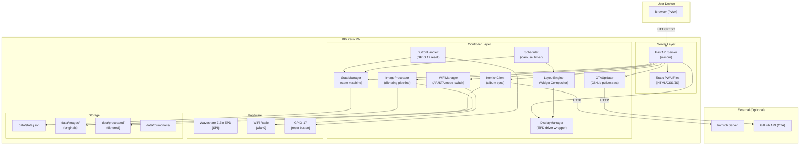
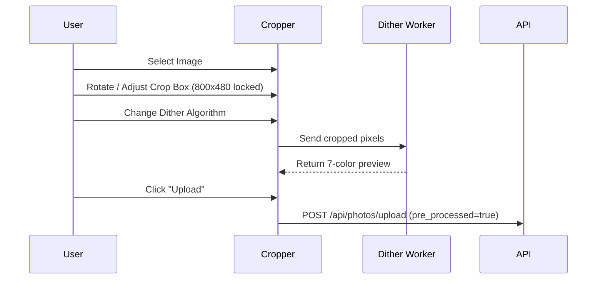
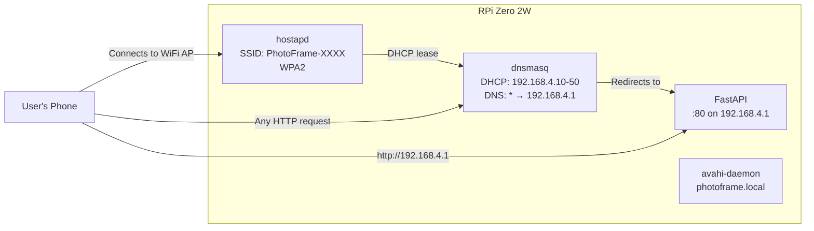
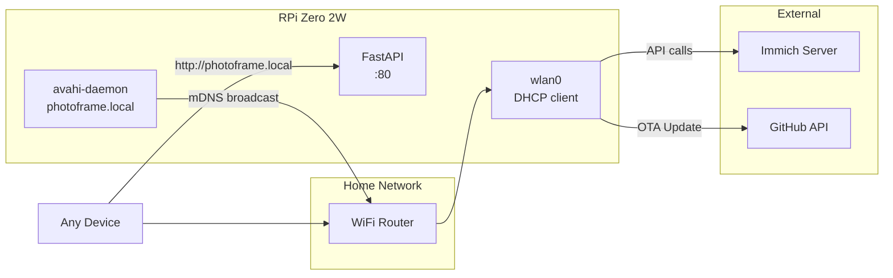
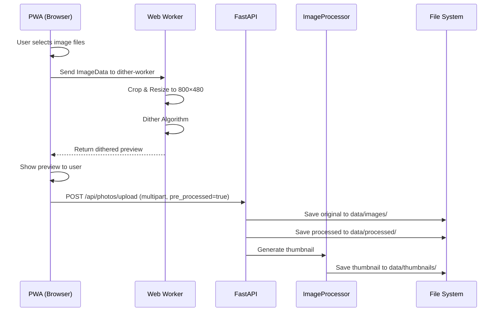
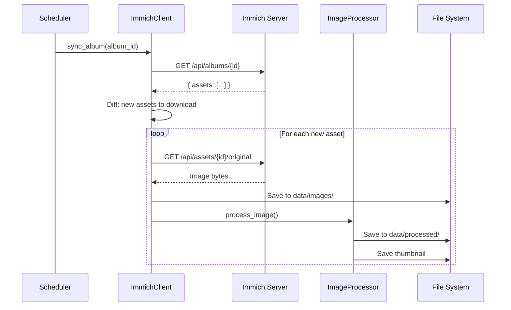

# Photo Frame — Technical Design Document

## 1. System Architecture Overview



---

## 2. Directory Structure

```
/opt/photo-frame-controller/
├── app/
│   ├── __init__.py
│   ├── main.py                    # Entry point — starts FastAPI + controller
│   ├── controller/
│   │   ├── __init__.py
│   │   ├── state_manager.py       # State machine + persistence
│   │   ├── ota_updater.py         # OTA download and installation logic
│   │   ├── layout_engine.py       # Composites images + widgets using PIL
│   │   ├── display_manager.py     # EPD hardware wrapper
│   │   ├── image_processor.py     # Dithering, resize, palette quantization
│   │   ├── wifi_manager.py        # AP mode / STA mode switching
│   │   ├── immich_client.py       # Immich API integration
│   │   ├── button_handler.py      # GPIO reset button
│   │   ├── scheduler.py           # Carousel timer / Immich sync scheduler
│   │   └── widgets/               # Future plugins (clock.py, weather.py)
│   ├── server/
│   │   ├── __init__.py
│   │   ├── app.py                 # FastAPI application factory
│   │   ├── routes/
│   │   │   ├── __init__.py
│   │   │   ├── photos.py          # Photo upload/management endpoints
│   │   │   ├── settings.py        # Frame settings endpoints
│   │   │   ├── wifi.py            # WiFi config endpoints
│   │   │   ├── immich.py          # Immich integration endpoints
│   │   │   ├── system.py          # System status/reset/OTA endpoints
│   │   │   └── display.py         # Display control endpoints
│   │   ├── middleware/
│   │   │   ├── __init__.py
│   │   │   └── auth.py            # Optional PIN authentication
│   │   └── schemas.py             # Pydantic request/response models
│   └── waveshare_epd/             # Vendor driver (existing)
├── web/                            # PWA static files
│   ├── index.html
│   ├── manifest.json
│   ├── sw.js                       # Service worker
│   ├── css/
│   │   └── style.css
│   ├── js/
│   │   ├── app.js                  # Main application logic
│   │   ├── api.js                  # API client wrapper
│   │   ├── editor.js               # Crop, rotate, canvas manipulations
│   │   ├── upload.js               # Upload logic + progress
│   │   ├── dither-worker.js        # Web Worker for client-side dithering (Floyd-Steinberg/Atkinson)
│   │   └── components/
│   │       ├── setup-wizard.js
│   │       ├── gallery.js
│   │       ├── settings.js
│   │       └── immich-config.js
│   └── assets/
├── config/
│   ├── default-state.json          # Factory default state template
│   └── default.jpg                 # Default boot image (or generated)
├── data/
│   ├── state.json                  # Runtime state (mutable)
│   ├── images/                     # Original uploaded images
│   ├── processed/                  # Dithered/quantized versions
│   └── thumbnails/                 # Small thumbnails for PWA gallery
├── service/
│   └── photo-frame-controller.service
├── requirements.txt
└── setup.sh
```

---

## 3. Controller Design

### 3.1 State Manager
The `StateManager` is the central coordinator. It owns the state file and provides the canonical view of the system's current mode. Includes persistence and state transition logic.

### 3.2 OTA Updater
Manages checking, downloading, and applying updates from GitHub.

```python
class OTAUpdater:
    def __init__(self, repo="saxanmol/photo-frame-controller"):
        self.repo = repo
        
    async def check_for_updates(self) -> dict:
        """Query GitHub API for latest release/artifact. Return version info."""
        
    async def download_and_apply(self, artifact_url: str) -> bool:
        """
        1. Download zip file to /tmp
        2. Extract contents
        3. Copy over /opt/photo-frame-controller (excluding /data and /config)
        4. Trigger systemd service restart via dbus or sudo command
        """
```

### 3.3 Layout Engine & Widgets
Instead of the `DisplayManager` directly rendering raw images, the `LayoutEngine` acts as an intermediary, treating the display as a canvas.

```python
class LayoutEngine:
    def __init__(self, display_manager):
        self.display = display_manager
        
    def render(self, base_image_path: str, widgets_config: dict) -> Image:
        """
        1. Open base_image (already 800x480)
        2. If widgets_config.clock_enabled: Overlay clock text/graphics
        3. If widgets_config.weather_enabled: Overlay weather icons
        4. Return final composite Image
        """
```

### 3.4 Display Manager
Wraps the E-Ink hardware.
- Enforces the 180s minimum interval via thread locks.
- `show_setup_screen(ssid, password, url)` generates PIL text/QR layouts.

### 3.5 Image Processor
Handles server-side processing for Immich downloads or fallback. Resizes, crops, and dithers images to the 7-color palette (Black, White, Green, Blue, Red, Yellow, Orange).

### 3.6 WiFi Manager
Manages the dual-mode WiFi: Access Point (hostapd+dnsmasq) ↔ Station (nmcli).

### 3.7 Immich Client
Handles communication with an external Immich server (`httpx`). Checks for new assets in an album and queues downloads.

### 3.8 Scheduler & Button Handler
Carousel timer loop, Immich background sync loop, and GPIO 17 reset functionality.

---

## 4. API Server Design

### 4.1 FastAPI Application Structure
REST APIs mounted under `/api/`, PWA served under `/`.

### 4.2 API Endpoints — Detailed Design

**Photos API**
- `POST /api/photos/upload`: Accept multipart files. Supports `pre_processed=true` flag.
- `GET /api/photos`, `DELETE /api/photos/{id}`, `GET /api/photos/{id}/thumbnail`.

**Settings API**
- `GET/PUT /api/settings`: Manage carousel, display name, etc.
- `GET/PUT /api/settings/widgets`: Toggle widgets (clock, weather).

**WiFi API**
- `GET /api/wifi/status`, `GET /api/wifi/scan`, `POST /api/wifi/connect`.

**Immich API**
- `GET/PUT /api/integrations/immich`, `POST /api/integrations/immich/sync`.

**System & OTA API**
- `GET /api/system/status`: Storage, display state.
- `GET /api/system/ota`: Current version, update available, OTA settings.
- `PUT /api/settings/ota`: Configure auto-update preference.
- `POST /api/system/ota/update`: Manually trigger an update.

**Display Control API**
- `POST /api/display/refresh`, `POST /api/display/show/{photo_id}`.

### 4.3 Authentication Middleware
Optional PIN-based authentication (`X-Frame-PIN` header). Exempts `/api/wifi/status`.

---

## 5. PWA Design

### 5.1 Editor Flow (Client-Side Processing)
To reduce CPU load on the RPi Zero 2W and offer a better UX:



### 5.2 Application Architecture
The PWA is an SPA with vanilla JavaScript.
- Bottom navigation (Mobile-first).
- Dark theme matching the e-ink context.

### 5.3 Setup Wizard Flow
1. Welcome Screen
2. WiFi Config (connect to home network)
3. **OTA Check**: Initial mandatory update check over the internet.
4. Upload Photos (with Editor preview)
5. Carousel Config
6. Done

---

## 6. Networking Design

### 6.1 AP Mode (First-Time Setup)


### 6.2 Station Mode (Home Network)


---

## 7. Data Flow Diagrams

### 7.1 Image Upload Flow


### 7.2 Immich Sync Flow


---

## 8. Systemd & Process Design

```ini
[Unit]
Description=E-Ink Photo Frame Controller & Web Server
After=network.target bluetooth.target
Wants=avahi-daemon.service

[Service]
User=root
WorkingDirectory=/opt/photo-frame-controller
ExecStart=/opt/photo-frame-controller/venv/bin/python -m app.main
Restart=always
RestartSec=5
Environment=PYTHONPATH=/opt/photo-frame-controller

# Resource limits for RPi Zero 2W
MemoryMax=256M
CPUQuota=90%

[Install]
WantedBy=multi-user.target
```

---

## 9. Error Handling & Recovery

| Scenario | Handling |
|----------|----------|
| Display refresh fails | Log error, retry after 180s, max 3 retries |
| WiFi AP creation fails | Log error, retry with different channel |
| Home WiFi connect fails | Revert to AP mode, show error on display |
| Immich server unreachable | Exponential backoff (5min → 15min → 1hr → 4hr) |
| OTA download fails | Revert to current version, log error |
| Disk full during upload | Return 507 error, warn user in PWA |
| State file corrupted | Reset to default-state.json |

---

## 10. Dependencies (Updated requirements.txt)

```
# Hardware
RPi.GPIO
pillow
spidev

# Web server
fastapi
uvicorn[standard]

# HTTP client (for Immich, OTA)
httpx

# QR code generation (for setup screen)
qrcode[pil]

# Utilities
python-multipart    # For FastAPI file uploads
aiofiles            # Async file operations
pydantic            # Data validation
```
